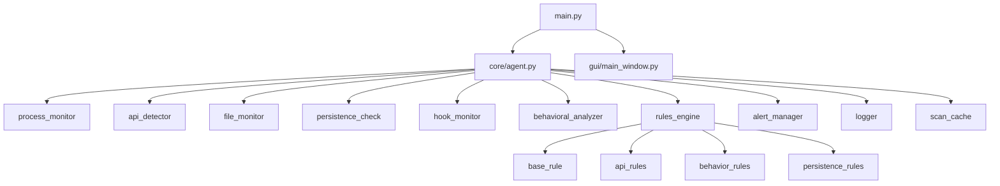

# 🛡️ Keylogger Detection System

<div align="center">

[](https://www.python.org/downloads/)
[](LICENSE)
[](https://www.microsoft.com/windows)
[]()

**Un système de détection et de surveillance en temps réel des keyloggers basé sur l'analyse comportementale et les règles de sécurité.**

[Fonctionnalités](#-fonctionnalités) •
[Installation](#-installation) •
[Utilisation](#-utilisation) •
[Documentation](#-documentation) •
[Contribuer](#-contribuer)

</div>

---

## 📋 Table des matières

- [À propos](#-à-propos)
- [Fonctionnalités](#-fonctionnalités)
- [Architecture](#-architecture)
- [Installation](#-installation)
- [Utilisation](#-utilisation)
- [Configuration](#-configuration)
- [Règles de détection](#-règles-de-détection)
- [Tests](#-tests)
- [Documentation technique](#-documentation-technique)
- [Contribuer](#-contribuer)
- [Licence](#-licence)

---

## 🎯 À propos

Le **Keylogger Detection System** est un agent de sécurité avancé conçu pour surveiller, détecter et alerter en temps réel sur la présence de keyloggers et autres logiciels malveillants. 

Utilisant une approche multi-couches basée sur :
- 🔍 L'analyse comportementale
- 📊 Un système de scoring intelligent
- 🧩 Des règles de détection modulaires
- 🔄 La surveillance en temps réel

### Pourquoi ce projet ?

Les keyloggers représentent une menace sérieuse pour la sécurité des données personnelles. Ce système offre une protection proactive en détectant les comportements suspects avant qu'ils ne causent des dommages.

---

## ✨ Fonctionnalités

### 🔍 Détection Multi-Niveaux

| Catégorie | Description | Score |
|-----------|-------------|-------|
| **API Suspectes** | Détection d'appels à des API Windows dangereuses (hooks, keystate, etc.) | +10 pts |
| **Surveillance Fichiers** | Monitoring des écritures de frappes et accès suspects | +15 pts |
| **Activité Réseau** | Détection de communications suspectes | +20 pts |
| **Persistance** | Identification des mécanismes d'auto-démarrage | +25 pts |
| **Hooks Système** | Surveillance des hooks clavier/souris | +30 pts |
| **Analyse Comportementale** | Détection d'anomalies et patterns suspects | +5-15 pts |

### 🎨 Interface Utilisateur

- **Mode GUI** : Interface graphique moderne et intuitive avec Tkinter
- **Mode Console** : Terminal avancé pour les administrateurs système
- **Dashboard en temps réel** : Visualisation instantanée des menaces
- **Historique complet** : Journal détaillé des alertes et événements

### ⚡ Performances

- Cache intelligent pour optimiser les analyses
- Multi-threading pour une surveillance non-bloquante
- Faible impact sur les ressources système
- Mise à jour en temps réel

---

## 🏗️ Architecture

### Diagramme de composants

#### Version 1 : Mermaid Simplifié 



#### Version 2 : Diagramme ASCII

```
                           main.py
                              |
                +-------------+-------------+
                |                           |
           core/agent.py            gui/main_window.py
                |
    +-----------+-----------+-----------+
    |           |           |           |
process_    api_      file_       persistence_
monitor   detector   monitor        check
    |           |           |           |
    +-----------|-----------|-----------|
                |
        +-------+-------+
        |               |
   rules_engine    alert_manager
        |               |
    +---+---+       +---+---+
    |   |   |       |       |
 base api behav  logger  scan_cache
 rule rule rule
```

#### Version 3 : Tableau Hiérarchique

| Niveau | Composant | Dépendances | Rôle |
|--------|-----------|-------------|------|
| **0** | `main.py` | - | Point d'entrée de l'application |
| **1** | `core/agent.py` | main.py | Agent principal de surveillance |
| **1** | `gui/main_window.py` | main.py | Interface utilisateur graphique |
| **2** | `process_monitor` | agent.py | Surveillance des processus |
| **2** | `api_detector` | agent.py | Détection des API suspectes |
| **2** | `file_monitor` | agent.py | Surveillance fichiers/réseau |
| **2** | `persistence_check` | agent.py | Vérification de persistance |
| **2** | `hook_monitor` | agent.py | Surveillance des hooks |
| **2** | `behavioral_analyzer` | agent.py | Analyse comportementale |
| **2** | `rules_engine` | agent.py | Moteur de règles |
| **2** | `alert_manager` | agent.py | Gestion des alertes |
| **2** | `scan_cache` | agent.py | Système de cache |
| **3** | `base_rule` | rules_engine | Classe de base des règles |
| **3** | `api_rules` | rules_engine | Règles API |
| **3** | `behavior_rules` | rules_engine | Règles comportementales |
| **3** | `persistence_rules` | rules_engine | Règles de persistance |
| **3** | `logger` | alert_manager | Journalisation |

> **Note :** Si les diagrammes Mermaid ne s'affichent pas, GitHub peut avoir besoin de quelques minutes pour les rendre ou vous devez actualiser le cache.

### 📁 Structure du projet

```
keylogger_detector/
├── 📂 core/                    # Modules principaux
│   ├── agent.py               # Agent de surveillance principal
│   ├── process_monitor.py     # Surveillance des processus
│   ├── api_detector.py        # Détection d'API suspectes
│   ├── file_monitor.py        # Surveillance fichiers/réseau
│   ├── persistence_check.py   # Vérification de persistance
│   ├── hook_monitor.py        # Surveillance des hooks
│   ├── behavioral_analyzer.py # Analyse comportementale
│   ├── scan_cache.py          # Système de cache
│   ├── site_api.py            # Intégration APIs externes
│   └── rules_engine.py        # Moteur de règles
│
├── 📂 rules/                   # Règles de détection
│   ├── base_rule.py           # Classe de base
│   ├── api_rules.py           # Règles API
│   ├── behavior_rules.py      # Règles comportementales
│   └── persistence_rules.py   # Règles de persistance
│
├── 📂 alerts/                  # Système d'alertes
│   ├── alert_manager.py       # Gestionnaire d'alertes
│   └── logger.py              # Journalisation
│
├── 📂 gui/                     # Interface graphique
│   └── main_window.py         # Fenêtre principale
│
├── 📂 config/                  # Configuration
│   └── settings.py            # Paramètres globaux
│
├── 📂 tests/                   # Tests unitaires
│   └── test_rules.py
│
├── 📄 main.py                 # Point d'entrée
├── 📄 test_system.py          # Système de test
├── 📄 requirements.txt        # Dépendances Python
├── 🔧 run_detector.bat        # Lancement rapide (Windows)
└── 🔧 activate_env.bat        # Activation environnement
```

---

## 🚀 Installation

### Prérequis

- **Python** 3.8 ou supérieur
- **Système d'exploitation** : Windows 10/11 (recommandé)
- **Permissions** : Administrateur (pour certaines fonctionnalités avancées)

### Installation standard

```bash
# 1. Cloner le dépôt
git clone https://github.com/votre-username/keylogger-detector.git
cd keylogger-detector

# 2. Créer un environnement virtuel
python -m venv keylogger_detector_env

# 3. Activer l'environnement
# Windows
keylogger_detector_env\Scripts\activate
# Linux/Mac
source keylogger_detector_env/bin/activate

# 4. Installer les dépendances
pip install -r requirements.txt
```

### Installation rapide (Windows)

```bash
# Utiliser le script d'activation automatique
activate_env.bat
```

### Vérification de l'installation

```bash
python main.py --version
```

---

## 💻 Utilisation

### Démarrage rapide

#### Mode Interface Graphique (Recommandé pour utilisateurs)

```bash
python main.py --gui
```

ou utilisez le script de lancement :

```bash
run_detector.bat
```

#### Mode Console (Pour administrateurs système)

```bash
python main.py
```

### Options de ligne de commande

```bash
python main.py [OPTIONS]

Options:
  --gui              Lance l'interface graphique
  --no-gui           Force le mode console uniquement
  --verbose, -v      Active le mode verbeux
  --config FILE      Utilise un fichier de configuration personnalisé
  --scan-interval N  Définit l'intervalle de scan (secondes)
  --version          Affiche la version
  --help, -h         Affiche l'aide
```

### Exemples d'utilisation

```bash
# Lancement avec interface graphique et logs détaillés
python main.py --gui --verbose

# Mode console avec configuration personnalisée
python main.py --config custom_config.json

# Scan rapide avec intervalle de 5 secondes
python main.py --scan-interval 5
```

---

## ⚙️ Configuration

### Fichier de configuration

Le fichier `config/settings.py` contient tous les paramètres configurables :

```python
# Exemple de configuration
SETTINGS = {
    # Seuils de détection
    "THRESHOLDS": {
        "INFO": 15,      # Alerte informative
        "WARNING": 30,   # Alerte attention
        "CRITICAL": 50   # Alerte critique
    },
    
    # Scores par catégorie
    "SCORES": {
        "API_SUSPICIOUS": 10,
        "FILE_WRITE": 15,
        "NETWORK_ACTIVITY": 20,
        "PERSISTENCE": 25,
        "HOOK_DETECTED": 30,
        "BEHAVIOR_ANOMALY": 5
    },
    
    # Intervalle de scan (secondes)
    "SCAN_INTERVAL": 10,
    
    # Cache
    "CACHE_DURATION": 300,  # 5 minutes
    
    # Logging
    "LOG_LEVEL": "INFO",
    "LOG_FILE": "keylogger_detector.log"
}
```

### Configuration personnalisée

Créez un fichier JSON pour vos paramètres personnalisés :

```json
{
  "scan_interval": 5,
  "thresholds": {
    "critical": 60
  },
  "enable_cache": true
}
```

Puis lancez avec :

```bash
python main.py --config my_config.json
```

---

## 🎯 Règles de détection

### Système de scoring

Le système utilise un scoring cumulatif pour évaluer le niveau de menace :

| Score Total | Niveau | Action |
|-------------|--------|--------|
| 0-14 | ✅ Normal | Aucune |
| 15-29 | ℹ️ Info | Journalisation |
| 30-49 | ⚠️ Attention | Alerte utilisateur |
| 50+ | 🚨 Critique | Alerte + Blocage recommandé |

### Catégories de règles

#### 1. Règles API (`api_rules.py`)

Détecte l'utilisation d'API Windows dangereuses :

- `SetWindowsHookEx` : Installation de hooks (+10 pts)
- `GetAsyncKeyState` : Lecture état clavier (+10 pts)
- `ReadProcessMemory` : Lecture mémoire processus (+10 pts)

#### 2. Règles Comportementales (`behavior_rules.py`)

Analyse les patterns d'activité :

- Fréquence d'accès inhabituelle (+5-15 pts)
- Corrélation d'événements suspects (+10 pts)
- Anomalies temporelles (+5 pts)

#### 3. Règles de Persistance (`persistence_rules.py`)

Identifie les mécanismes de persistance :

- Entrées registre autostart (+25 pts)
- Services cachés (+25 pts)
- Exécution depuis %TEMP% (+15 pts)
- DLL injection (+30 pts)

### Ajout de règles personnalisées

Créez une nouvelle règle en héritant de `BaseRule` :

```python
from rules.base_rule import BaseRule

class CustomRule(BaseRule):
    def __init__(self):
        super().__init__(
            name="Ma Règle Personnalisée",
            severity="WARNING",
            score=20
        )
    
    def evaluate(self, process_data):
        # Votre logique ici
        if self.is_suspicious(process_data):
            return self.score
        return 0
```

---

## 🧪 Tests

### Exécuter les tests

```bash
# Tests unitaires
python -m pytest tests/

# Test du système complet
python test_system.py

# Tests avec couverture
python -m pytest --cov=core tests/
```

### Tests de régression

```bash
# Tester toutes les règles
python tests/test_rules.py

# Test de performance
python tests/test_performance.py
```

---

## 📚 Documentation technique

### APIs détectées

| API | Description | Risque |
|-----|-------------|--------|
| `SetWindowsHookEx` | Installation de hooks clavier/souris | 🔴 Élevé |
| `GetAsyncKeyState` | Lecture état des touches | 🔴 Élevé |
| `ReadProcessMemory` | Lecture mémoire autre processus | 🟠 Moyen |
| `WriteProcessMemory` | Écriture mémoire autre processus | 🔴 Élevé |
| `CreateRemoteThread` | Injection de code | 🔴 Critique |

### Fichiers surveillés

- Fichiers logs dans `%TEMP%`
- Fichiers texte avec patterns de frappes
- Fichiers cachés système
- Exécutables sans signature

### Analyse réseau

- Connexions sortantes non-HTTPS
- Transferts de données suspects
- Communications vers IPs non-répertoriées

---

## 🤝 Contribuer

Les contributions sont les bienvenues ! Voici comment participer :

### Processus de contribution

1. **Fork** le projet
2. **Créer** une branche pour votre fonctionnalité
   ```bash
   git checkout -b feature/amelioration-detection
   ```
3. **Commit** vos changements
   ```bash
   git commit -m "Ajout: détection de nouveaux patterns"
   ```
4. **Push** vers la branche
   ```bash
   git push origin feature/amelioration-detection
   ```
5. **Ouvrir** une Pull Request

### Guidelines

- Suivre PEP 8 pour le style Python
- Ajouter des tests pour les nouvelles fonctionnalités
- Documenter les nouvelles règles de détection
- Mettre à jour le README si nécessaire

### Rapport de bugs

Utilisez le système d'issues GitHub en incluant :

- Description détaillée du problème
- Étapes pour reproduire
- Logs pertinents (`keylogger_detector.log`)
- Version de Python et du système

---

## 📊 Stack technique

| Technologie | Usage | Version |
|-------------|-------|---------|
| **Python** | Langage principal | 3.8+ |
| **Tkinter** | Interface graphique | Standard |
| **psutil** | Surveillance processus | Latest |
| **pywin32** | API Windows | Latest |
| **threading** | Concurrence | Standard |
| **logging** | Journalisation | Standard |
| **json** | Configuration | Standard |

---

## 🐛 Dépannage

### Problèmes courants

**Erreur : "Permission denied"**
```bash
# Solution : Lancer en tant qu'administrateur
```

**Erreur : "Module not found"**
```bash
# Solution : Réinstaller les dépendances
pip install -r requirements.txt --force-reinstall
```

**Performance lente**
```bash
# Solution : Augmenter l'intervalle de scan
python main.py --scan-interval 15
```

### Logs de débogage

Les logs détaillés sont disponibles dans :
```
keylogger_detector.log
```

Activer les logs verbeux :
```bash
python main.py --verbose
```

---

## 📄 Licence

Ce projet est sous licence **MIT**. Voir le fichier [LICENSE](LICENSE) pour plus de détails.

```
MIT License - Libre d'utilisation, modification et distribution
```

---

## 👥 Auteurs

- **Votre Nom** - *Développeur principal* - [@votre-github](https://github.com/votre-username)

Voir aussi la liste des [contributeurs](https://github.com/votre-username/keylogger-detector/contributors).

---

## 🙏 Remerciements

- Communauté Python pour les excellentes bibliothèques
- Contributeurs open-source
- Chercheurs en sécurité informatique

---

## 📞 Support

- 📧 **Email** : support@keylogger-detector.com
- 💬 **Issues** : [GitHub Issues](https://github.com/votre-username/keylogger-detector/issues)
- 📖 **Documentation** : [Wiki](https://github.com/votre-username/keylogger-detector/wiki)
- 🌐 **Site web** : [www.keylogger-detector.com](https://www.keylogger-detector.com)

---

<div align="center">

**⭐ Si ce projet vous est utile, n'hésitez pas à lui donner une étoile ! ⭐**

Made with ❤️ for cybersecurity

[⬆ Retour en haut](#️-keylogger-detection-system)

</div>
