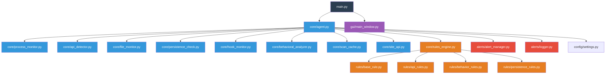

# Système de Détection de Keyloggers

## Description
Un agent de sécurité qui surveille et détecte les keyloggers en temps réel basé sur des règles comportementales.

## Architecture



### Structure des fichiers

```
keylogger_detector/
├── core/
│   ├── agent.py              # Agent principal de surveillance
│   ├── process_monitor.py    # Surveillance des processus
│   ├── api_detector.py       # Détection d'API suspectes
│   ├── file_monitor.py       # Surveillance fichiers/réseau
│   ├── persistence_check.py  # Vérification de persistance
│   ├── hook_monitor.py       # Surveillance des hooks système
│   ├── behavioral_analyzer.py # Analyse comportementale
│   ├── scan_cache.py         # Cache des analyses
│   ├── site_api.py           # API externes
│   └── rules_engine.py       # Moteur de règles et scoring
├── rules/
│   ├── __init__.py
│   ├── base_rule.py          # Classe de base pour les règles
│   ├── api_rules.py          # Règles pour API suspectes
│   ├── behavior_rules.py     # Règles comportementales
│   └── persistence_rules.py  # Règles de persistance
├── alerts/
│   ├── __init__.py
│   ├── alert_manager.py      # Gestionnaire d'alertes
│   └── logger.py             # Système de logs
├── gui/
│   ├── __init__.py
│   └── main_window.py        # Interface graphique
├── config/
│   └── settings.py           # Configuration
├── tests/
│   ├── __init__.py
│   └── test_rules.py         # Tests unitaires
├── main.py                   # Point d'entrée principal
├── test_system.py           # Système de test
├── requirements.txt          # Dépendances
├── run_detector.bat          # Script de lancement Windows
└── activate_env.bat          # Script d'activation environnement
```

## Fonctionnalités

### 1. Surveillance des Processus
- Liste des processus en cours
- Détection de nouveaux processus
- Analyse des chemins d'exécution

### 2. Détection d'API Suspectes
- SetWindowsHookEx (hooks clavier/souris)
- GetAsyncKeyState (lecture clavier)
- ReadProcessMemory (lecture mémoire)
- SetWindowsHookExA/W (hooks Unicode/ANSI)

### 3. Surveillance Fichiers/Réseau
- Détection d'écriture de frappes dans fichiers
- Surveillance des connexions réseau suspectes
- Analyse des patterns de communication
- Monitoring des accès aux fichiers sensibles

### 4. Vérification de Persistance
- Autostart (registre Windows)
- Services cachés
- Exécution depuis %TEMP%
- DLL injection
- Analyse des hooks système

### 5. Analyse Comportementale
- Patterns d'activité suspects
- Corrélation d'événements
- Apprentissage des comportements normaux
- Détection d'anomalies

### 6. Moteur de Règles Avancé
- Système de scoring basé sur des règles
- Seuils d'alerte configurables
- Règles modulaires et extensibles
- Cache des analyses pour optimisation

### 7. Interface Utilisateur
- Interface graphique moderne et intuitive
- Mode console pour administration avancée
- Tableau de bord en temps réel
- Historique des alertes et événements

## Installation

### Prérequis
- Python 3.8 ou supérieur
- Windows 10/11 (recommandé)
- Permissions administrateur pour certaines fonctionnalités

### Installation rapide
```bash
# Cloner le dépôt
git clone <repository-url>
cd detection-of-keylogger

# Créer et activer l'environnement virtuel
python -m venv keylogger_detector_env
keylogger_detector_env\Scripts\activate

# Installer les dépendances
pip install -r requirements.txt
```

### Installation via script (Windows)
```bash
# Exécuter le script d'installation
activate_env.bat
```

## Utilisation

### Mode Interface Graphique (Recommandé)
```bash
python main.py --gui
```

### Mode Console
```bash
python main.py
```

### Scripts de lancement (Windows)
```bash
# Lancement rapide avec GUI
run_detector.bat

# Lancement en mode console uniquement
python main.py --no-gui
```

### Options avancées
```bash
# Mode verbeux
python main.py --verbose

# Mode test
python test_system.py

# Configuration personnalisée
python main.py --config custom_settings.json
```

## Règles de Détection

Le système utilise des règles prédéfinies pour détecter les comportements suspects :

### Scores par catégorie
- **Score API** : +10 points par API suspecte utilisée
- **Score Fichier** : +15 points si écriture de frappes détectée
- **Score Réseau** : +20 points si communication suspecte
- **Score Persistance** : +25 points si tentative de persistance
- **Score Hook** : +30 points si hook système détecté
- **Score Comportemental** : +5 à +15 points selon l'anomalie

### Seuils d'alerte
- **Info** : 15-29 points
- **Attention** : 30-49 points  
- **Critique** : 50+ points

### Configuration des règles
Les seuils et scores sont configurables dans `config/settings.py`.

## Technologies Utilisées

- **Python 3.8+** : Langage principal
- **Tkinter** : Interface graphique
- **psutil** : Surveillance des processus
- **pywin32** : API Windows
- **threading** : Multithreading
- **logging** : Journalisation
- **json** : Configuration et données

## Contribuer

1. Fork le projet
2. Créer une branche de fonctionnalité (`git checkout -b feature/nouvelle-fonction`)
3. Commit les changements (`git commit -am 'Ajout nouvelle fonctionnalité'`)
4. Push vers la branche (`git push origin feature/nouvelle-fonction`)
5. Créer une Pull Request

## Licence

Ce projet est sous licence MIT - voir le fichier LICENSE pour détails.

## Support

Pour toute question ou problème :
- Vérifier les logs dans `keylogger_detector.log`
- Consulter la documentation technique
- Ouvrir une issue sur le dépôt GitHub
